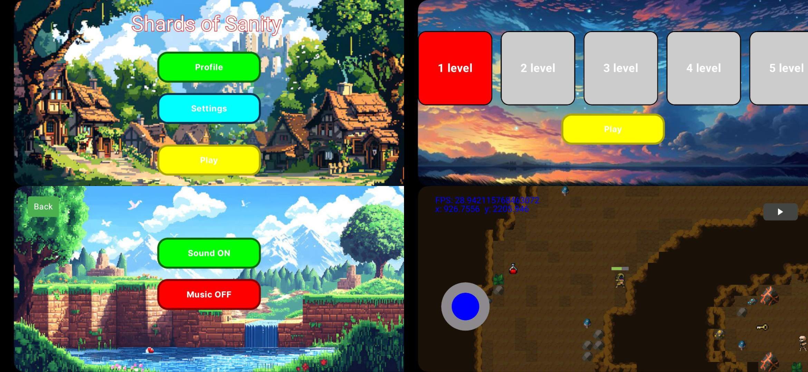

# Adventure Game (Kotlin)

### Using technologies such as Kotlin, MVVM, Dagger Hilt, Retrofit, Canvas, Coil.

It's a 2d game where player can walk, attack enemies, find goods, interact with npc, lose hp, pass levels etc.

